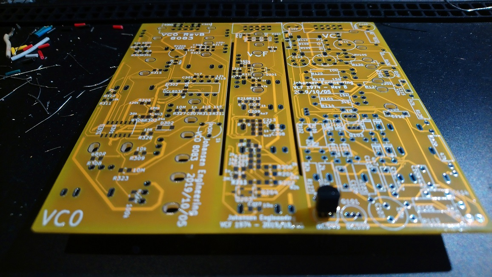
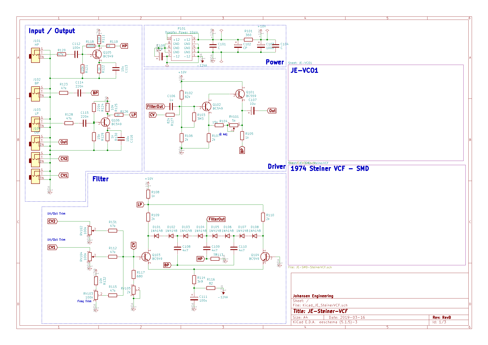
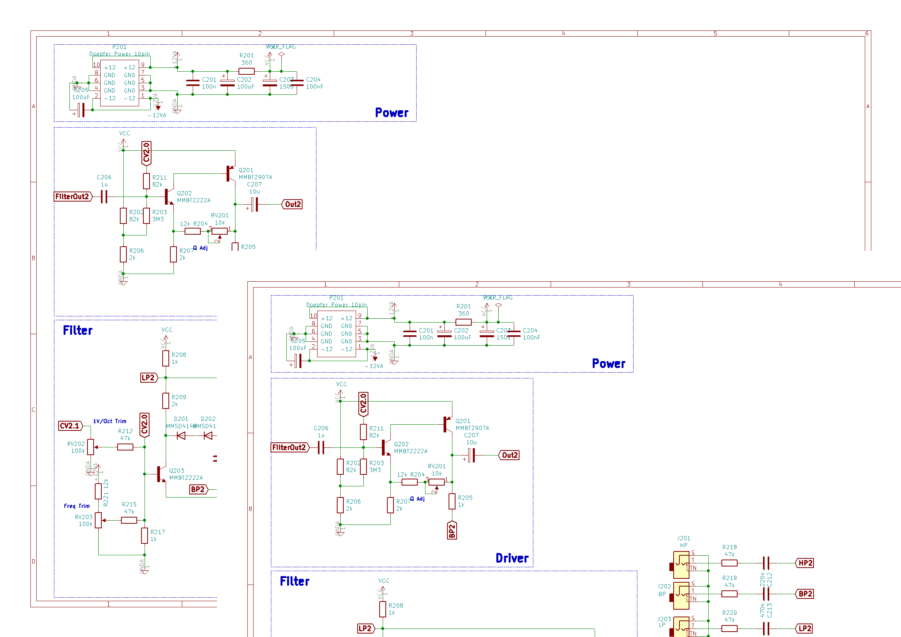
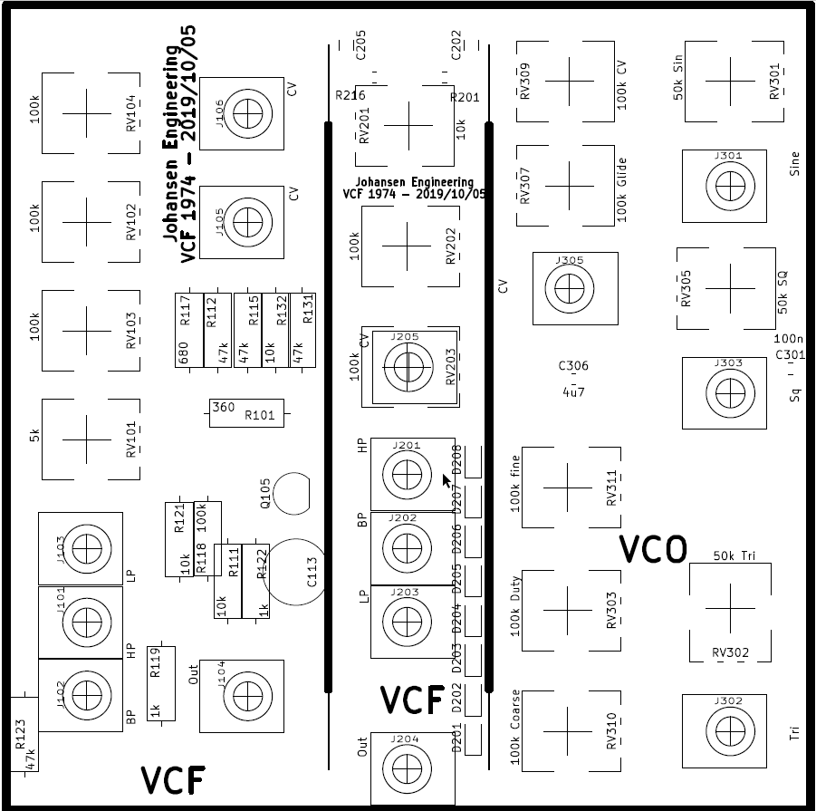
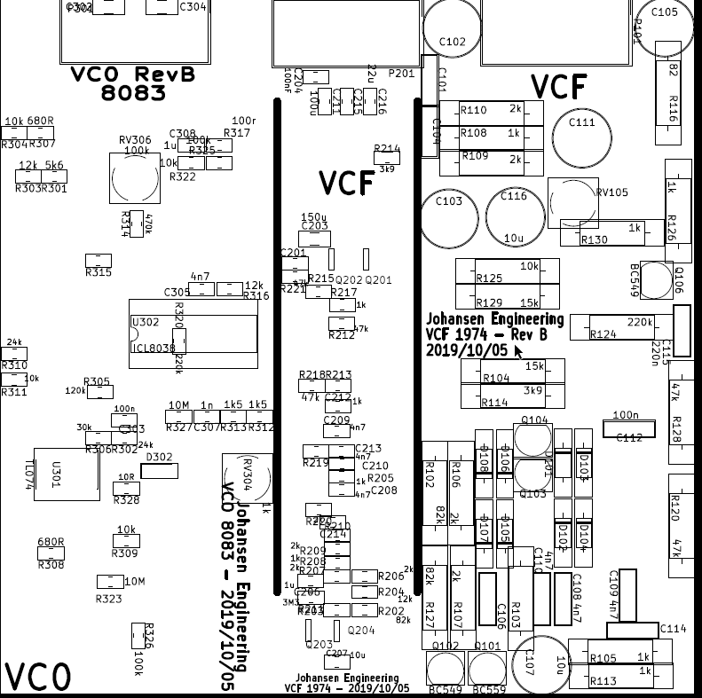
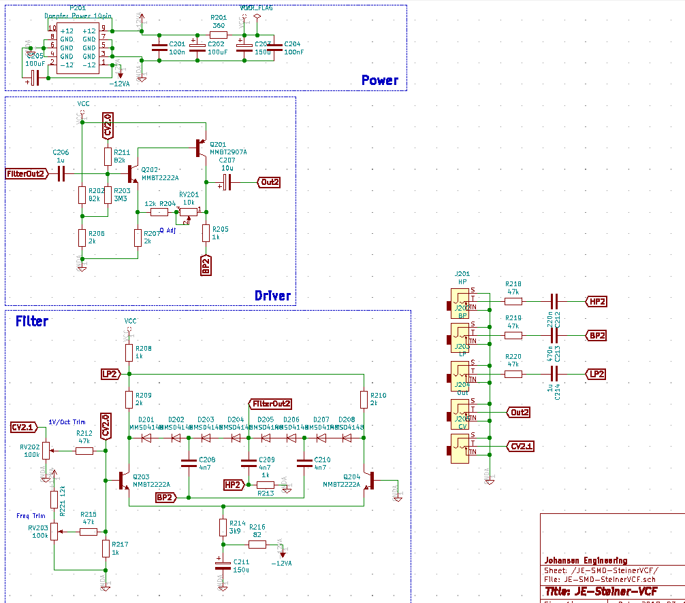
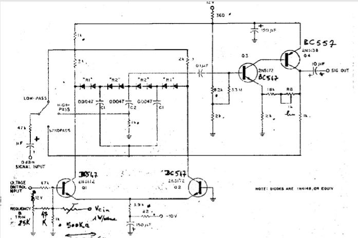
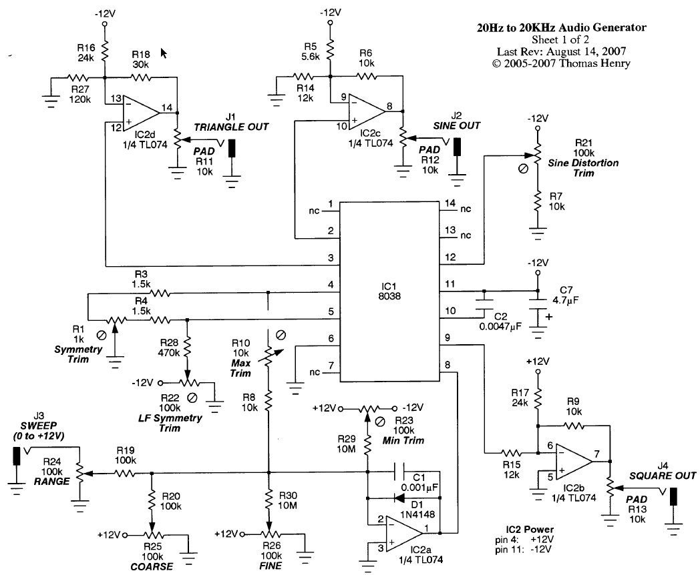

# Johansen Engineering Steiner VCF RevB

# Status - VCF working
## Initial 
| Stage  | Detail | Status |
| ------------- | ------------- | ------------- |
| create material  | sch/pcb | OK  |
| | gerber | OK |
| production  |   | OK |
|  | produced | OK |
|  | delivered | Delivered |
## Preliminary validation
| Test  | Detail | Status |
| ------------- | ------------- | ------------- |
| Initial Inspection | VCO | OK - bottom looks empty w/o gnd fill |
| Initial Inspection | VCF | OK - bottom looks empty w/o gnd fill |
| | | Very difficult to mount as footprints are getting over soldering points in many places|
| | | BP in the bottom |
| | | HP in the middle |
| | | LP on top |
| Initial Inspection | VCF SMD | OK - bottom looks empty w/o gnd fill |
| Initial Technical Test | VCO | SINE has PCB error - and Sine pot has +12V to chassis |
| Initial Technical Test | VCF | One pot gets -12v on chassis |
| Initial Technical Test | VCF SMD |  |
| Initial Product Test | VCO | Nice -  |
| Initial Product Test | VCF |  |
| | | CV1 and CV2 works fine |
| | | Q is doing something |
| | | Uncertain if the freq pot is right |
| Initial Product Test | VCF SMD|  |
## Secondary validation
| Test  | Detail | Status |
| ------------- | ------------- |------------- |
| Product Test |  | |
| Product Test |  |  |
| Quality | | |
| Quality | | |
| Long Term Product Test |  |  |
| Power Draw | VCO | +12 4mA -12
| Power Draw | VCF | +12 8mA -12
| Power Draw | VCF SMD | +12 ?mA -12

## Errata
### Errata - VCO
* Due to footprint one of the pots gets -12v on chassis

* Sine signal is shorted to GND

* Glide pot is reversed

### Errata - VCF
* Due to footprint one of the pots gets -12v on chassis

* R127 - DNP (Do not populate)

* R119 swap with 220nF-1uF to ac couple input stage

* R126 swap with 1uF to ac couple input stage

### Errata - VCF SMD

## Issues and Notes
### VCF
Very difficult to mount as footprints are getting over soldering points in many places
### VCO
 * Remove output pots
 * Collect jacks in the bottom
 * Fix errors (glide,  POT, PCB errors, footprint tightened)
 * Consider removing sine shaper
# Pictures

# Schematic

# Layout

# Inspiration

-----------------------

# Johansen Engineering Steiner VCF

# Purpose
Test some of the original designs for inspiration and reference.

# Status - Preliminary tests
## Initial 
| Stage  | Detail | Status |
| ------------- | ------------- | ------------- |
| create material  | sch/pcb | produced Rev A  |
| | gerber | produced and uploaded RevA |
| production  | ordered  | OK |
|  | produced | OK |
|  | delivered | OK |
## Preliminary validation
| Test  | Detail | Status |
| ------------- | ------------- | ------------- |
| Initial Inspection | THT VCF - Visual - Component Mounting | NOT OK |
| Initial Inspection | SMD VCF - Visual - Component Mounting | NOT OK |
| Initial Inspection | VCO  - Visual - Component Mounting | OK |
| Initial Technical Test | THT VCF - Base operation | NOT OK |
| | Knobs | Freq working for LP - Q for HP/BP - CV trim - not ok|
| Initial Technical Test | SMD VCF | NOT TESTED |
| Initial Technical Test | VCO  - Sine - Triangle - Square | OK |
| | Trimmers | OK |
| | Knobs | OK |
| Initial Product Test | VCO CV from LFO | OK |
| | VCO Vactrol CV from LFO | no real effect with CV coupling |

## Secondary validation
| Test  | Detail | Status |
| ------------- | ------------- |------------- |
| Product Test | VCF | |
| Product Test | VCO | Works nicely - frequency is a bit high |
| Quality | VCF | |
| Quality | VCO | |
| Long Term Product Test | VCO | OpAmp gets hot - esp if no output is conn to the square |
| Power Draw | VCO | 50-120mA depending on output...

## Errata
### Errata - THT VCF
 * C111 reverse polarity
 * R102 should go from +10v to connection between R103 and R106 - and +10v sould not go to Q102 base - Critical
### Errata - SMD VCF
 * R should go from +10v to connection between R and R - and +10v sould not go to Q base - Critical
### Errata - VCO
 * 470K values not correct for all resistors
 * 0R values not correct - fixed in RevB
 * Outputs should not be shorted to GND when not connected
 
## Issues and Notes
### VCF THT/SMD
 * The filter needs adjustments and the feedback is not stable. a 56k from CV to base of Q102 helps a bit.
 * Input circuit for CV needs rework
 * Input series resistor and capacitor could be a good addon for the filter inputs
 * Frequency adjust seems to work for LP only
 * Q adjust is minor and seems to work on HP and a bit on BP

### VCO
 * Tweak values for better frequency range
 * Op Amp can get hot
 * Draws more power if nothing is inserted into the Square output?
 
 
# Physical Construction

# Features

## SMD VCF Schematic

## VCO Schematic

# Inspirational sources:
## Steiner VCF 1974 THT

## Steiner VCF 1974 SMD
Same schematic - different components - half the size

## VCO ICL 8083
Based on a Thomas Henry schematic

# Details
